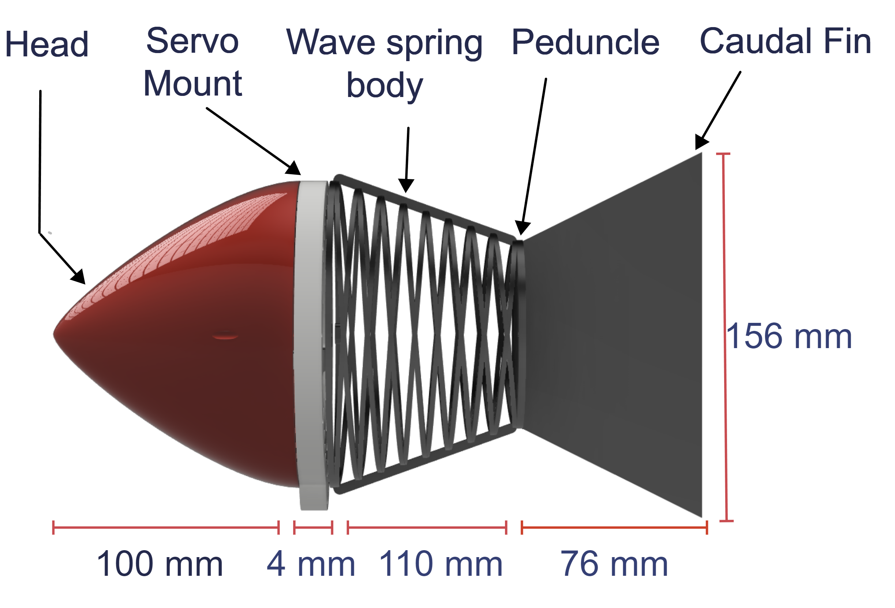
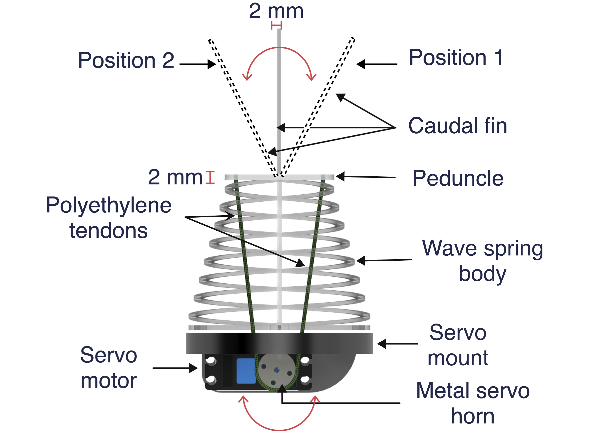

## Individual components of a single module fish

---

    
Design and Fabrication

    
    A modular approach provides the flexibility of performing eclectic locomotion gaits by increasing the number of modules.  
    Example: 1 module -> oscillatory pattern; multi module (3 and above) -> undulatory pattern 

<table>
  <tr>
    <th>Part</th>
    <th>Material</th>
  </tr>
  <tr>
    <td>Caudal fin</td>
    <td>TPU-95A</td>
  </tr>
    <tr>
    <td>Body</td>
    <td>TPU-95A</td>
  </tr>
    </tr>
    <tr>
    <td>Rigid head</td>
    <td>CPE</td>
  </tr>
  <tr>
    <td>Servo mount</td>
    <td>PETG</td>
  </tr>
</table>

## Tendon-driven actuation 

---

